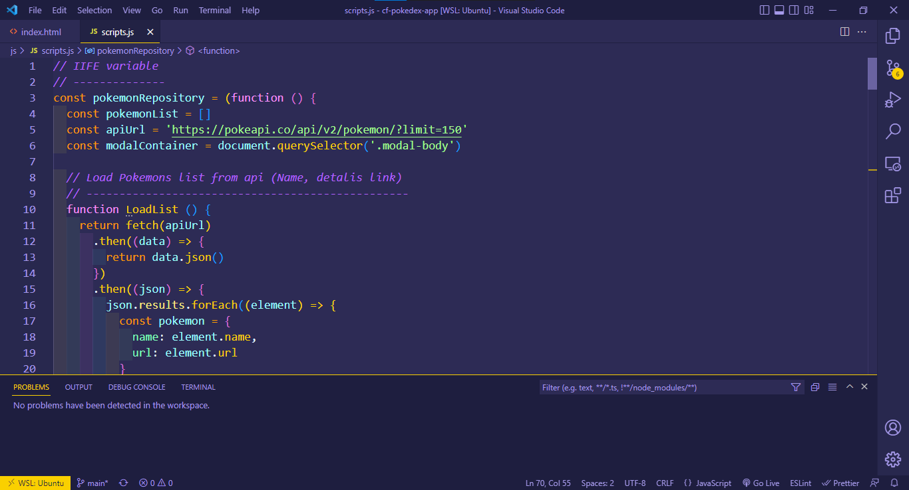

# Pokedex App

## Table of contents

- [Overview](#overview)
  - [Screenshot](#screenshot)
  - [Built with](#built-with)

## Overview

To build a small web application with HTML, CSS, and JavaScript that loads
data from an external API and enables the viewing of data points in detail.

### Screenshot

app screenshot

eslint

### Built with

- Semantic HTML5 markup
- Javascript
- W3C validator
- ES lint
- Bootstrap 

